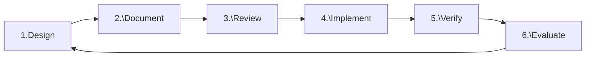
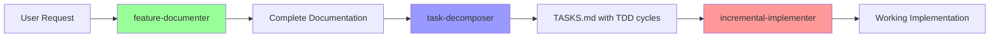

Always follow the instructions in plan.md. When I say "go", find the next unmarked test in plan.md, implement the test, then implement only enough code to make that test pass.

# ⚡ MANDATORY DEVELOPMENT METHODOLOGY: DDRIVE

## DDRIVE: Design-Document-Review-Implement-Verify-Evaluate

### ⚠️ CRITICAL: This is NOT optional. Every feature MUST go through ALL 6 phases



## 🤖 Agent Ecosystem (13 Specialized Agents)

### Foundation Agents (3)

- **requirement-analyzer** (indigo): Analyzes requirements → DDRIVE tasks
- **architecture-guardian** (cyan): Validates architecture patterns and dependency health
- **project-manager** (gold): Taskmaster-style natural language task, sprint, and milestone management

### Core Orchestrators (5)

- **feature-documenter** (indigo): Orchestrates feature documentation through multiple agents
- **task-decomposer** (blue): Orchestrates task decomposition into TDD-based executable tasks
- **incremental-implementer** (green): Orchestrates incremental implementation following TDD
- **code-refactorer** (teal): Orchestrates systematic refactoring through coordinated agents
- **project-validator** (crimson): Orchestrates complete project validation and health checks

### Implementation Agents (3)

- **test-manager** (green): Comprehensive test management (generation, execution, TDD, coverage, mocking, regression)
- **code-implementer** (blue): All code implementation, optimization, and improvements
- **documentation-writer** (yellow): Creates and maintains all documentation types

### Quality Agents (2)

- **code-validator** (purple): Validates code quality, readability, and standards compliance
- **dependency-resolver** (orange): Manages dependencies, security, and compatibility

## 🚨 ENFORCEMENT RULES - NO EXCEPTIONS

### You MUST

1. **ALWAYS** start with Phase 1 (DESIGN) for any new feature
2. **NEVER** write code before completing Phases 1-3 (Design, Document, Review)
3. **ALWAYS** write tests before implementation (Phase 4)
4. **NEVER** skip any phase or checklist item
5. **ALWAYS** use the specified agents for each phase
6. **NEVER** proceed to next phase without completing current phase checklist
7. **NEVER** perform tasks directly - ALWAYS use Task tool to invoke appropriate agents
8. **NEVER** write/edit code without using the designated agents first

### Automatic Rejection Triggers

- Code written before design phase → REJECT
- Implementation without tests → REJECT
- Tests written after code → REJECT
- Missing documentation → REJECT
- Skipped review phase → REJECT
- Coverage below 80% → REJECT
- Direct task execution without using agents → REJECT
- Writing code without invoking designated agents → REJECT

### Phase Progression Gates

```bash
DESIGN → All checklist items ✅ → DOCUMENT
DOCUMENT → All checklist items ✅ → REVIEW
REVIEW → All checklist items ✅ → IMPLEMENT
IMPLEMENT → All checklist items ✅ → VERIFY
VERIFY → All checklist items ✅ → EVALUATE
EVALUATE → All checklist items ✅ → COMPLETE
```

## DDRIVE Phase Details

### Phase 1: DESIGN 🎯

**Purpose**: Think before coding. Define what we're building and why.

**Agents**: requirement-analyzer → project-manager → architecture-guardian → code-implementer → dependency-resolver

**Checklist**:

- [ ] Requirements clearly understood (requirement-analyzer)
- [ ] Task created with DDRIVE structure (project-manager)
- [ ] Architecture diagram created (architecture-guardian)
- [ ] Interfaces defined (code-implementer)
- [ ] Dependencies identified (dependency-resolver)
- [ ] Performance requirements specified (code-validator)

### Phase 2: DOCUMENT 📝

**Purpose**: Create clear specifications before writing any code.

**Agents**: documentation-writer → feature-documenter → task-decomposer

**Checklist**:

- [ ] Interface documentation complete
- [ ] API contracts defined
- [ ] Test scenarios documented
- [ ] Usage examples provided
- [ ] Error conditions specified
- [ ] Performance metrics defined

### Phase 3: REVIEW 🔍

**Purpose**: Validate design and documentation before implementation.

**Agents**: code-validator → architecture-guardian → dependency-resolver → test-manager → project-manager

**Checklist**:

- [ ] Design reviewed and approved (code-validator)
- [ ] Architecture validated (architecture-guardian)
- [ ] Naming conventions verified (code-validator)
- [ ] Dependencies approved (dependency-resolver)
- [ ] Test strategy confirmed (test-manager)
- [ ] Sprint capacity available (project-manager)

### Phase 4: IMPLEMENT 💻

**Purpose**: Write code following TDD Red-Green-Refactor cycle.

**Agents**: test-manager → code-implementer → incremental-implementer

**TDD Cycle**:

```
FOR EACH feature:
  1. Write failing test → test-manager
  2. Run test (expect failure) → test-manager
  3. Write minimal implementation → code-implementer 
  4. Run test (expect success) → test-manager
  5. Refactor if needed → code-refactorer
  6. Run all tests → test-manager
```

**Checklist**:

- [ ] Test written before code
- [ ] Test fails initially
- [ ] Minimal code to pass test
- [ ] All tests passing
- [ ] Code coverage >80%
- [ ] No code without tests

### Phase 5: VERIFY ✅

**Purpose**: Ensure code meets all quality standards.

**Agents**: test-manager → code-validator → project-validator

**Checklist**:

- [ ] All tests passing (100%)
- [ ] Coverage meets threshold (>80%)
- [ ] No performance regressions
- [ ] Code quality validated
- [ ] Documentation updated
- [ ] No security vulnerabilities

### Phase 6: EVALUATE 📊

**Purpose**: Learn and improve from the implementation.

**Agents**: code-validator → architecture-guardian → documentation-writer → project-validator

**Checklist**:

- [ ] Performance metrics collected
- [ ] Lessons learned documented
- [ ] Technical debt identified
- [ ] Improvement tasks created
- [ ] Documentation finalized
- [ ] Knowledge shared with team

## CORE DEVELOPMENT PRINCIPLES

### Readable Code Foundation

- **Readability First**: Code is read 10x more than written
- **Clarity Over Cleverness**: Explicit is better than implicit
- **Intention-Revealing**: Names and structure should explain purpose
- **Consistent Terminology**: One concept, one word throughout

### TDD Methodology

- Always follow Red → Green → Refactor cycle
- Write the simplest failing test first
- Implement minimum code to make tests pass
- Refactor only after tests are passing
- Separate structural from behavioral changes

### Code Quality Standards

- Eliminate duplication ruthlessly
- Express intent clearly through naming and structure
- Make dependencies explicit
- Keep methods small and focused
- Minimize state and side effects
- Use the simplest solution that could possibly work

### Commit Discipline

- Only commit when ALL tests pass
- ALL compiler/linter warnings resolved
- Single logical unit of work
- Clear commit messages (structural vs behavioral)
- Small, frequent commits

## 📋 DOCUMENT-FIRST DEVELOPMENT WORKFLOW

### Three-Stage Feature Implementation



### Stage 1: Documentation (feature-documenter)
Creates `docs/features/NNN-feature-name/` with:
- README.md (overview)
- SPECIFICATION.md (requirements)
- DESIGN.md (architecture)
- INTERFACE.md (APIs)
- TEST-CASES.md (TDD scenarios)
- EXAMPLES.md (usage)

### Stage 2: Task Decomposition (task-decomposer)
Generates TASKS.md with:
- TDD cycle tasks (RED → GREEN → REFACTOR)
- Document references for each task
- Dependencies and ordering
- Verification criteria

### Stage 3: Implementation (incremental-implementer)
Executes tasks incrementally:
- Follows TASKS.md sequentially
- Implements TDD cycles properly
- Updates progress in real-time
- Supports resume after interruption

## ⚡ AGENT USAGE ENFORCEMENT

### When User Requests ANY Work

1. **STOP** - Do NOT work directly
2. **IDENTIFY** the appropriate agent for the task
3. **USE Task tool** to invoke the agent
4. **FOLLOW** the agent's guidance and output
5. **NEVER** bypass agents for any development work

### For New Features: Use Document-First Workflow
1. `Task tool → feature-documenter` for complete documentation
2. `Task tool → task-decomposer` for task generation
3. `Task tool → incremental-implementer` for TDD implementation

## EXAMPLE WORKFLOW

When user says: "Build user authentication"

**Your Response**:

```bash
"Using Task tool to invoke project-manager agent for DDRIVE Phase 1: DESIGN"

[Task tool call to project-manager agent]

Using Task tool to invoke required agents:
- Task tool → requirement-analyzer: Parse requirements
- Task tool → architecture-guardian: Validate auth architecture
- Task tool → performance-optimizer: Set constraints

Design Checklist:
☐ Requirements understood
☐ Architecture defined
☐ Interfaces specified
☐ Dependencies identified
☐ Performance targets set
☐ Security addressed

[Present design and wait for approval before Phase 2]
```

Continue through all 6 phases sequentially, using Task tool to invoke specified agents and completing all checklist items before proceeding.

**⚠️ CRITICAL**: Always use Task tool to invoke agents. NEVER work directly.

## TASK MANAGEMENT INTEGRATION

Every task MUST have:

1. **Unique ID**: TASK-XXX format
2. **DDRIVE Phase Tracking**: Current phase and checklist
3. **Dependencies**: Blocking and blocked-by relationships
4. **Acceptance Criteria**: Clear, measurable outcomes
5. **Story Points**: Estimated complexity
6. **Sprint Assignment**: Which sprint it belongs to

Use project-manager for complete task lifecycle management including tasks, sprints, milestones, and progress tracking.

Always write one test at a time, make it run, then improve structure. Always run all tests each time.
