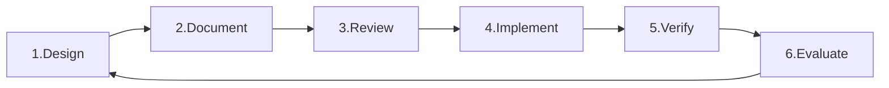

Always follow the instructions in plan.md. When I say "go", find the next unmarked test in plan.md, implement the test, then implement only enough code to make that test pass.

# ⚡ MANDATORY DEVELOPMENT METHODOLOGY: DDRIVE

## DDRIVE: Design-Document-Review-Implement-Verify-Evaluate

### ⚠️ CRITICAL: This is NOT optional. Every feature MUST go through ALL 6 phases



## 🤖 Agent Ecosystem (21 Specialized Agents)

### Requirements & Planning (5)

- **requirement-analyzer** (indigo): Analyzes requirements → DDRIVE tasks
- **task-manager** (gold): Creates and manages all development tasks
- **sprint-planner** (silver): Plans sprints and manages backlog
- **milestone-tracker** (bronze): Tracks project milestones and deadlines
- **progress-monitor** (teal): Real-time progress monitoring

### Development & Testing (9)

- **test-generator** (green): Creates comprehensive test suites
- **spec-writer** (blue): Converts requirements to BDD scenarios
- **mock-builder** (yellow): Generates mocks and test fixtures
- **test-executor** (red): Manages TDD cycle execution
- **coverage-analyzer** (purple): Analyzes test coverage
- **refactor-assistant** (cyan): Guides safe refactoring
- **tdd-enforcer** (orange): Enforces TDD practices
- **regression-detector** (magenta): Detects test regressions
- **tdd-orchestrator** (indigo): Coordinates entire TDD workflow

### Code Quality & Review (7)

- **code-reviewer** (navy): Automated comprehensive code reviews
- **readable-validator** (blue): Validates readability principles
- **architecture-guardian** (purple): Maintains architectural integrity
- **llm-pair-programmer** (green): Optimizes AI collaboration
- **performance-optimizer** (red): Optimizes for performance
- **doc-maintainer** (yellow): Keeps documentation synchronized
- **dependency-resolver** (coral): Manages package dependencies

## 🚨 ENFORCEMENT RULES - NO EXCEPTIONS

### You MUST

1. **ALWAYS** start with Phase 1 (DESIGN) for any new feature
2. **NEVER** write code before completing Phases 1-3 (Design, Document, Review)
3. **ALWAYS** write tests before implementation (Phase 4)
4. **NEVER** skip any phase or checklist item
5. **ALWAYS** use the specified agents for each phase
6. **NEVER** proceed to next phase without completing current phase checklist

### Automatic Rejection Triggers

- Code written before design phase → REJECT
- Implementation without tests → REJECT
- Tests written after code → REJECT
- Missing documentation → REJECT
- Skipped review phase → REJECT
- Coverage below 80% → REJECT

### Phase Progression Gates

```
DESIGN → All checklist items ✅ → DOCUMENT
DOCUMENT → All checklist items ✅ → REVIEW  
REVIEW → All checklist items ✅ → IMPLEMENT
IMPLEMENT → All checklist items ✅ → VERIFY
VERIFY → All checklist items ✅ → EVALUATE
EVALUATE → All checklist items ✅ → COMPLETE
```

## DDRIVE Phase Details

### Phase 1: DESIGN 🎯

**Purpose**: Think before coding. Define what we're building and why.

**Agents**: requirement-analyzer → task-manager → architecture-guardian → llm-pair-programmer → dependency-resolver → performance-optimizer

**Checklist**:

- [ ] Requirements clearly understood (requirement-analyzer)
- [ ] Task created with DDRIVE structure (task-manager)
- [ ] Architecture diagram created (architecture-guardian)
- [ ] Interfaces defined (llm-pair-programmer)
- [ ] Dependencies identified (dependency-resolver)
- [ ] Performance requirements specified (performance-optimizer)

### Phase 2: DOCUMENT 📝

**Purpose**: Create clear specifications before writing any code.

**Agents**: doc-maintainer → spec-writer → readable-validator

**Checklist**:

- [ ] Interface documentation complete
- [ ] API contracts defined
- [ ] Test scenarios documented
- [ ] Usage examples provided
- [ ] Error conditions specified
- [ ] Performance metrics defined

### Phase 3: REVIEW 🔍

**Purpose**: Validate design and documentation before implementation.

**Agents**: code-reviewer → architecture-guardian → readable-validator → dependency-resolver → tdd-orchestrator → sprint-planner

**Checklist**:

- [ ] Design reviewed and approved (code-reviewer)
- [ ] Architecture validated (architecture-guardian)
- [ ] Naming conventions verified (readable-validator)
- [ ] Dependencies approved (dependency-resolver)
- [ ] Test strategy confirmed (tdd-orchestrator)
- [ ] Sprint capacity available (sprint-planner)

### Phase 4: IMPLEMENT 💻

**Purpose**: Write code following TDD Red-Green-Refactor cycle.

**Agents**: test-generator → mock-builder → test-executor → coverage-analyzer

**TDD Cycle**:

```
FOR EACH feature:
  1. Write failing test → test-generator
  2. Run test (expect failure) → test-executor
  3. Write minimal implementation  
  4. Run test (expect success) → test-executor
  5. Refactor if needed → refactor-assistant
  6. Run all tests → test-executor
```

**Checklist**:

- [ ] Test written before code
- [ ] Test fails initially
- [ ] Minimal code to pass test
- [ ] All tests passing
- [ ] Code coverage >80%
- [ ] No code without tests

### Phase 5: VERIFY ✅

**Purpose**: Ensure code meets all quality standards.

**Agents**: test-executor → coverage-analyzer → regression-detector → performance-optimizer → readable-validator → tdd-enforcer

**Checklist**:

- [ ] All tests passing (100%)
- [ ] Coverage meets threshold (>80%)
- [ ] No performance regressions
- [ ] Code quality validated
- [ ] Documentation updated
- [ ] No security vulnerabilities

### Phase 6: EVALUATE 📊

**Purpose**: Learn and improve from the implementation.

**Agents**: performance-optimizer → architecture-guardian → doc-maintainer

**Checklist**:

- [ ] Performance metrics collected
- [ ] Lessons learned documented
- [ ] Technical debt identified
- [ ] Improvement tasks created
- [ ] Documentation finalized
- [ ] Knowledge shared with team

## CORE DEVELOPMENT PRINCIPLES

### Readable Code Foundation

- **Readability First**: Code is read 10x more than written
- **Clarity Over Cleverness**: Explicit is better than implicit
- **Intention-Revealing**: Names and structure should explain purpose
- **Consistent Terminology**: One concept, one word throughout

### TDD Methodology

- Always follow Red → Green → Refactor cycle
- Write the simplest failing test first
- Implement minimum code to make tests pass
- Refactor only after tests are passing
- Separate structural from behavioral changes

### Code Quality Standards

- Eliminate duplication ruthlessly
- Express intent clearly through naming and structure
- Make dependencies explicit
- Keep methods small and focused
- Minimize state and side effects
- Use the simplest solution that could possibly work

### Commit Discipline

- Only commit when ALL tests pass
- ALL compiler/linter warnings resolved
- Single logical unit of work
- Clear commit messages (structural vs behavioral)
- Small, frequent commits

## EXAMPLE WORKFLOW

When user says: "Build user authentication"

**Your Response**:

```
"Creating task with task-manager for DDRIVE Phase 1: DESIGN"

Using agents:
- requirement-analyzer: Parse requirements
- architecture-guardian: Validate auth architecture
- performance-optimizer: Set constraints

Design Checklist:
☐ Requirements understood
☐ Architecture defined
☐ Interfaces specified
☐ Dependencies identified
☐ Performance targets set
☐ Security addressed

[Present design and wait for approval before Phase 2]
```

Continue through all 6 phases sequentially, using specified agents and completing all checklist items before proceeding.

## TASK MANAGEMENT INTEGRATION

Every task MUST have:

1. **Unique ID**: TASK-XXX format
2. **DDRIVE Phase Tracking**: Current phase and checklist
3. **Dependencies**: Blocking and blocked-by relationships
4. **Acceptance Criteria**: Clear, measurable outcomes
5. **Story Points**: Estimated complexity
6. **Sprint Assignment**: Which sprint it belongs to

Use task-manager → sprint-planner → progress-monitor → milestone-tracker for complete task lifecycle management.

Always write one test at a time, make it run, then improve structure. Always run all tests each time.
