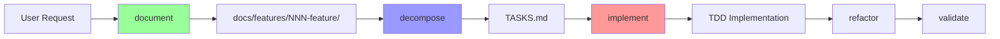

# 🚀 CLAUDE CODE DEVELOPMENT SYSTEM

## ⚡ CRITICAL: Orchestrator-First Development

**NEVER work directly. ALWAYS use orchestrators through Task tool.**

### 5 Core Orchestrator Commands
```bash
document   → feature-documenter    # Create complete documentation
decompose  → task-decomposer       # Break into TDD tasks  
implement  → incremental-implementer # Execute TDD implementation
refactor   → code-refactorer        # Systematic refactoring
validate   → project-validator      # Complete validation
```

## 🎯 MANDATORY WORKFLOW: Document → Decompose → Implement



### 📁 Documentation Structure
```
docs/features/NNN-feature-name/
├── README.md           # Feature overview
├── SPECIFICATION.md    # Requirements
├── DESIGN.md          # Architecture
├── INTERFACE.md       # APIs
├── TEST-CASES.md      # TDD scenarios
└── EXAMPLES.md        # Usage examples
```

## 🛑 ENFORCEMENT RULES - NO EXCEPTIONS

### You MUST
1. **ALWAYS** use orchestrators via Task tool - NEVER work directly
2. **ALWAYS** create documentation before any code
3. **ALWAYS** decompose into TDD tasks before implementation
4. **ALWAYS** follow Red → Green → Refactor cycle
5. **NEVER** write code without failing test first
6. **NEVER** skip orchestrator invocation

### Automatic Rejection
- Direct code writing → REJECT
- Code before documentation → REJECT  
- Implementation without tests → REJECT
- Tests after code → REJECT
- Coverage below 80% → REJECT
- Bypassing orchestrators → REJECT

## 📋 DDRIVE METHODOLOGY

### Design-Document-Review-Implement-Verify-Evaluate

Every feature MUST complete all 6 phases:

#### Phase 1: DESIGN
- Use: `requirement-analyzer`, `architecture-guardian`
- Output: Requirements, architecture, interfaces

#### Phase 2: DOCUMENT  
- Use: `document` command (feature-documenter)
- Output: Complete feature documentation

#### Phase 3: REVIEW
- Use: `code-validator`, `test-manager`
- Output: Validated design and test strategy

#### Phase 4: IMPLEMENT
- Use: `decompose` → `implement` commands
- Output: TDD implementation with tests

#### Phase 5: VERIFY
- Use: `validate` command (project-validator)
- Output: Quality metrics, coverage report

#### Phase 6: EVALUATE
- Use: `project-validator`, `documentation-writer`
- Output: Lessons learned, improvements

## 🤖 13-Agent Architecture

### Foundation (3)
- **requirement-analyzer**: Requirements → DDRIVE tasks
- **architecture-guardian**: Architecture validation
- **project-manager**: Task/sprint/milestone management

### Core Orchestrators (5)
- **feature-documenter**: Documentation orchestration
- **task-decomposer**: TDD task decomposition
- **incremental-implementer**: TDD implementation
- **code-refactorer**: Refactoring orchestration
- **project-validator**: Validation orchestration

### Implementation (3)
- **test-manager**: All testing operations
- **code-implementer**: Code writing/optimization
- **documentation-writer**: Documentation creation

### Quality (2)
- **code-validator**: Quality/standards validation
- **dependency-resolver**: Dependency management

## 💻 TDD Implementation Process

### Red-Green-Refactor Cycle
```
FOR EACH task in TASKS.md:
  1. RED: Write failing test (test-manager)
  2. GREEN: Minimal code to pass (code-implementer)
  3. REFACTOR: Improve structure (code-refactorer)
  4. VERIFY: All tests pass (test-manager)
```

### Task Structure in TASKS.md
```markdown
## Task 1: [Feature Name]
- [ ] Write test for X
- [ ] Implement X minimally
- [ ] Refactor if needed
- [ ] Verify all tests pass
```

## 📊 Quality Standards

### Code Principles
- **Readability First**: Clear over clever
- **Single Responsibility**: One function, one purpose
- **Test Coverage**: Minimum 80%
- **Small Commits**: Atomic, focused changes

### Commit Requirements
- All tests passing
- No warnings/errors
- Clear message
- Single logical change

## 🔄 Practical Workflow Example

User: "Add user authentication"

```bash
# Step 1: Document
Task → feature-documenter: "Create auth documentation"

# Step 2: Decompose  
Task → task-decomposer: "Generate TDD tasks from docs"

# Step 3: Implement
Task → incremental-implementer: "Execute TASKS.md"

# Step 4: Refactor
Task → code-refactorer: "Improve code structure"

# Step 5: Validate
Task → project-validator: "Validate implementation"
```

## ⚠️ KEY REMINDERS

1. **Orchestrators handle everything** - You just invoke them
2. **Documentation drives development** - No docs, no code
3. **Tests drive implementation** - No test, no code
4. **One task at a time** - Sequential, not parallel
5. **Validate constantly** - Quality gates at each phase

---

**Remember**: When in doubt, use an orchestrator. Never work directly.