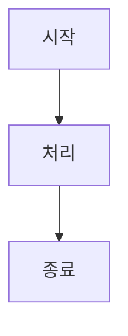

# Mermaid Fix Command

마크다운 파일 내의 모든 Mermaid 다이어그램을 검증하고 오류를 자동 수정하는 커맨드입니다.

## Usage

```bash
/code/mermaid-fix [path]
```

## What It Does

1. **의존성 확인** @mermaid-js/mermaid-cli 설치 상태를 확인하고 필요시 자동 설치
2. **다이어그램 추출** 지정된 경로의 마크다운 파일에서 ```mermaid 블록을 모두 추출
3. **문법 검증** mermaid-cli를 사용하여 각 다이어그램의 구문 오류를 검사
4. **오류 분석** LLM이 CLI 오류 메시지를 해석하고 구체적인 수정 방안을 제안
5. **자동 수정** 구문 오류, 논리적 구조, 가독성 문제를 해결한 수정안을 생성
6. **결과 리포트** 검사 결과와 수정사항을 요약한 보고서 제공

## Output

```text
🔍 Mermaid 다이어그램 검사 결과

📁 검사 대상: 3개 파일, 7개 다이어그램

✅ 정상: 4개 다이어그램
❌ 오류: 3개 다이어그램

== 오류 상세 ==

📄 docs/architecture.md:15
❌ 구문 오류: 잘못된 노드 연결 문법 (A->B should be A-->B)
✅ 수정안:


📄 docs/flow.md:42
❌ 논리적 구조: 미연결 노드 D 발견
✅ 수정안: 노드 D를 메인 플로우에 연결

📄 README.md:88
❌ 가독성: 들여쓰기 불일치
✅ 자동 수정 완료

== 요약 ==
• 총 3개 오류 수정
• 모든 다이어그램 검증 통과
• 수정된 파일은 자동 저장됨
```

## Success Criteria

**GOOD** = 모든 Mermaid 다이어그램이 mermaid-cli 검증을 통과하고, 구문/논리/가독성 문제가 해결됨
**BAD** = 검증 실패하는 다이어그램이 남아있거나, 수정 후에도 CLI 오류가 발생함
