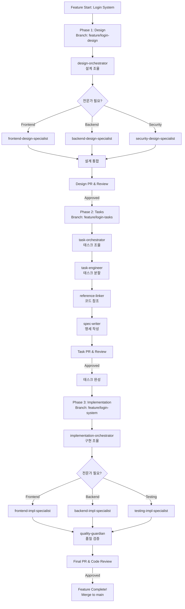

# Agent Development Workflow: Feature-Based Development with Git Integration

## Core Philosophy

**Feature = 하나의 완전한 기능 단위** (예: 로그인 기능, 결제 시스템, API 개발)
각 Feature는 Design → Task Documentation → Implementation의 3단계를 거쳐 완성되며,
각 단계마다 Git 브랜치 생성, 커밋, PR, 코드 리뷰가 통합됨

## Feature Structure

### Feature란?

하나의 기능을 처음부터 끝까지 완성하는 단위로, Git 워크플로우와 완전히 통합됨

**예시 Feature들:**

- Feature: 사용자 인증 시스템 (`feature/user-auth`)
- Feature: 결제 모듈 구현 (`feature/payment-module`)
- Feature: 대시보드 UI 개발 (`feature/dashboard-ui`)
- Feature: API Gateway 구축 (`feature/api-gateway`)

### Feature 내부의 3단계 프로세스 (Git 통합)

#### Phase 1: Design (설계)

**Git 작업:**

- 브랜치 생성: `feature/001-login-system-design`
- 설계 문서 커밋
- Design Review PR 생성

**담당 에이전트들:**

- `design-orchestrator`: 설계 세션 진행 및 전문가 조율
  - 필요시 `frontend-design-specialist` 호출
  - 필요시 `backend-design-specialist` 호출
  - 필요시 `system-software-design-specialist` 호출
  - 필요시 `security-design-specialist` 호출
  - 필요시 `data-design-specialist` 호출
  - **모든 전문가는 프로젝트 가이드라인 준수 확인**

**산출물:** `/documents/features/001-login-system/design/`

#### Phase 2: Task Documentation (태스크 문서화)

**Git 작업:**

- 브랜치 생성: `feature/001-login-system-tasks`
- 태스크 문서 커밋
- Task Review PR 생성

**담당 에이전트들:**

- `task-orchestrator`: 태스크 문서화 조율 및 전문가 배치
  - `task-engineer` 호출: 설계를 태스크로 분할
  - `reference-linker` 호출: 코드베이스 참조 링킹
  - `spec-writer` 호출: 기술 명세 작성
  - **모든 작업은 프로젝트 가이드라인 준수 확인**

**산출물:** `/documents/features/001-login-system/tasks/`

#### Phase 3: Implementation & Quality (구현 및 품질)

**Git 작업:**

- 브랜치 생성: `feature/001-login-system`
- 구현 커밋 (atomic commits)
- Implementation PR 생성
- 코드 리뷰 수행
- 머지 후 배포

**담당 에이전트들:**

- `implementation-orchestrator`: 구현 작업 조율 및 전문가 배치
  - 필요시 `frontend-impl-specialist` 호출
  - 필요시 `backend-impl-specialist` 호출
  - 필요시 `system-software-impl-specialist` 호출
  - 필요시 `database-impl-specialist` 호출
  - 필요시 `api-impl-specialist` 호출
  - 필요시 `testing-impl-specialist` 호출
  - **모든 전문가는 프로젝트 가이드라인 준수 확인**
- `quality-guardian`: 코드 리뷰 및 품질 검증
- `github-expert`: PR 관리 및 리뷰 프로세스

**산출물:**

- 실제 코드
- `/documents/features/001-login-system/quality/`

## Agent Hierarchy Example

### 로그인 Feature의 에이전트 호출 흐름

```
Feature: 로그인 시스템
│
├── Phase 1: Design
│   └── design-orchestrator (조율자)
│       ├── frontend-design-specialist (OAuth UI 설계)
│       ├── backend-design-specialist (인증 API 설계)
│       └── security-design-specialist (JWT vs Session 결정)
│
├── Phase 2: Task Documentation
│   └── task-orchestrator (조율자)
│       ├── task-engineer (태스크 분할)
│       ├── reference-linker (기존 auth 코드 참조)
│       └── spec-writer (API 명세 작성)
│
└── Phase 3: Implementation
    └── implementation-orchestrator (조율자)
        ├── frontend-impl-specialist (React 로그인 폼)
        ├── backend-impl-specialist (Node.js 인증 서버)
        ├── database-impl-specialist (User 테이블 구현)
        └── testing-impl-specialist (인증 테스트)
```

## Feature Workflow Example

### Feature: "사용자 로그인 시스템 구현" (Orchestrator + Specialists)



## Document Structure

```text
/documents
└── /features                      # 모든 Feature들의 루트
    ├── /001-login-system          # Feature 1: 로그인 시스템
    │   ├── /design                # Phase 1 산출물
    │   │   ├── requirements.md    # 요구사항 분석
    │   │   ├── architecture.md    # 시스템 설계
    │   │   ├── decisions.md       # ADR 문서
    │   │   └── diagrams/          # 다이어그램들
    │   ├── /tasks                 # Phase 2 산출물
    │   │   ├── task-list.md       # 태스크 목록
    │   │   ├── specifications.md  # 기술 명세
    │   │   └── references.md      # 코드 참조 (file:line)
    │   └── /quality               # Phase 3 산출물
    │       ├── review-notes.md    # 코드 리뷰
    │       └── feedback.md        # 개선사항
    │
    ├── /002-payment-module        # Feature 2: 결제 모듈
    │   ├── /design
    │   ├── /tasks
    │   └── /quality
    │
    └── /003-dashboard-ui          # Feature 3: 대시보드 UI
        ├── /design
        ├── /tasks
        └── /quality
```

## Git Workflow Integration

### 브랜치 전략

```
main
├── feature/001-login-design      # Phase 1: 설계
├── feature/001-login-tasks       # Phase 2: 태스크 문서
└── feature/001-login-system      # Phase 3: 구현
```

### PR 체크포인트

1. **Design PR**: 설계 문서 리뷰 및 승인
2. **Task PR**: 태스크 문서 리뷰 및 검증
3. **Implementation PR**: 코드 리뷰 및 최종 승인

### 커밋 컨벤션

- `feat(design):` 설계 문서 추가/수정
- `docs(task):` 태스크 문서 작성
- `feat(impl):` 기능 구현
- `test:` 테스트 추가
- `fix:` 버그 수정
- `refactor:` 코드 개선

## Key Principles

1. **설계 우선**: 코드 작성 전 충분한 논의와 PR 리뷰
2. **문서 기반**: 모든 구현은 승인된 태스크 문서 기반
3. **가이드라인 준수**: 모든 전문가는 `/documents/guidelines/` 필수 준수
4. **Orchestrator 패턴**: 각 Phase마다 조율자가 전문가 관리
5. **참조 연결**: 코드와 문서 간 명확한 링크
6. **단계별 리뷰**: 각 Phase마다 PR과 코드 리뷰
7. **원자적 커밋**: 작은 단위로 자주 커밋
8. **피드백 루프**: 구현 인사이트를 설계로 반영

## Agent Architecture: Orchestrator + Specialists

### Phase 1: Design Agents

#### Orchestrator

- `design-orchestrator` - 설계 세션 진행 및 전문가 조율

#### Design Specialists (설계 전문가)

**모든 설계 전문가는 `/documents/guidelines/` 의 프로젝트 가이드라인을 필수로 준수**

- `frontend-design-specialist` - UI/UX, React, Vue 설계
- `backend-design-specialist` - API, 서버, 데이터베이스 설계
- `system-design-specialist` - 분산 시스템, 마이크로서비스 설계
- `system-software-design-specialist` - OS, 드라이버, 임베디드 시스템 설계
- `security-design-specialist` - 보안 아키텍처, 인증/인가 설계
- `data-design-specialist` - 데이터베이스 스키마, 데이터 플로우 설계

### Phase 2: Task Agents

#### Orchestrator

- `task-orchestrator` - 태스크 문서화 조율 및 작업 배치

#### Task Specialists (태스크 전문가)

- `task-engineer` - 태스크 문서화 및 분할
- `reference-linker` - 코드베이스 참조 연결
- `spec-writer` - 기술 명세 작성

### Phase 3: Implementation Agents

#### Orchestrator

- `implementation-orchestrator` - 구현 작업 조율 및 전문가 배치

#### Implementation Specialists (구현 전문가)

**모든 구현 전문가는 `/documents/guidelines/` 의 프로젝트 가이드라인을 필수로 준수**

- `frontend-impl-specialist` - React, Vue, Angular 구현
- `backend-impl-specialist` - Node.js, Python, Java 서버 구현
- `system-software-impl-specialist` - C/C++, Rust, 시스템 프로그래밍
- `database-impl-specialist` - SQL, NoSQL, ORM 구현
- `api-impl-specialist` - REST, GraphQL, gRPC 구현
- `testing-impl-specialist` - 단위/통합/E2E 테스트 구현

### Cross-Phase Agents

- `github-expert` - Git 워크플로우 및 GitHub 프로세스 관리
- `quality-guardian` - 코드 품질 보증 및 리뷰 전문가
- `workflow-coordinator` - Feature 워크플로우 전체 조율 전문가

### Management & Expert Agents

- `agent-expert` - 에이전트 설계 기준 및 품질 관리 전문가
- `system-prompt-expert` - 시스템 프롬프트 설계 및 최적화 전문가

## Next Steps

1. **에이전트 파일 생성**: 각 에이전트의 `.md` 파일 작성 ✅ 완료 (총 21개)
2. **템플릿 정의**: Feature 문서 템플릿 표준화
3. **자동화 스크립트**: Git 워크플로우 자동화
4. **파일럿 테스트**: 실제 Feature로 워크플로우 검증
