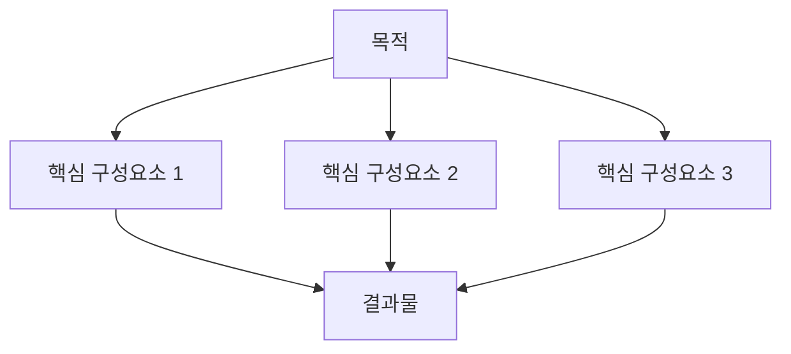

# ${PROJECT_NAME} - ${FEATURE_NAME} 설계 문서

## 설계 개요

### 목적 달성 방법

| 요구사항 | 설계 접근법 | 핵심 전략 |
|---------|------------|----------|
| [요구사항 1] | [해결 접근법] | [핵심 전략] |
| [요구사항 2] | [해결 접근법] | [핵심 전략] |
| ... | ... | ... |

### 전체 구조 개요

[전체적인 접근 방법과 흐름에 대한 설명]

## 핵심 구성 요소

[각 요구사항을 만족하기 위해 필요한 구성요소들과 역할]

1. **[구성요소 1]**: [역할과 책임]
2. **[구성요소 2]**: [역할과 책임]

...

## 구현 접근법

[요구사항들을 어떤 순서로 어떻게 구현할 것인가?]

### 단계 1: [단계명]

- 요구사항: [관련 요구사항 번호]
- 접근 방법: [추상적 수준의 해결 방법]

### 단계 2: [단계명]

- 요구사항: [관련 요구사항 번호]
- 접근 방법: [추상적 수준의 해결 방법]

...

## 상호작용 설계

[구성요소들이 어떻게 연결되어 목적을 달성하는가?]

## 제약사항 및 고려사항

[requirements.md에서 명시된 제약사항들을 어떻게 반영하는가?]

<!--
작성 가이드:
- requirements.md의 각 요구사항이 어떻게 구현될지 추상적 수준에서 설명
- 구체적인 기술이나 도구보다는 접근 방법과 구조에 집중
- 구성요소들 간의 관계와 역할을 명확히 정의
- 구현 순서와 우선순위를 고려한 단계적 접근법 제시

변수 사용 가이드:
- ${PROJECT_NAME}: 프로젝트명으로 자동 대체
- ${FEATURE_NAME}: 피쳐명으로 자동 대체
- ${API_BASE_URL}, ${DB_HOST} 등 환경별 변수 활용
- 변경 가능한 값들은 하드코딩하지 말고 변수로 추상화
-->